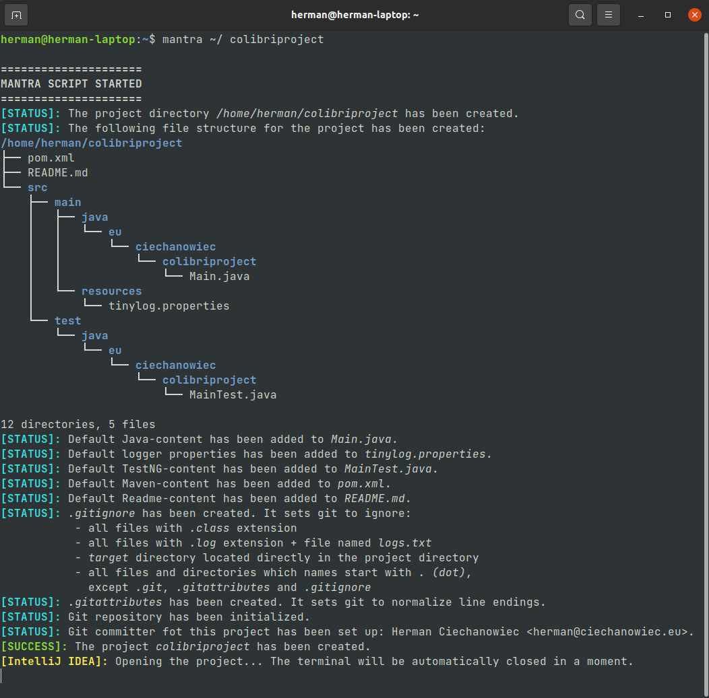

# Mantra

## Table of Contents
1. [Basic Info](#Basic-Info)
2. [Script's Algorithm](#Scripts-Algorithm)
3. [Aliases]($Aliases)
4. [Screenshots](#Screenshots)
5. [License](#License)

## Basic Info
This program is a Shell script for Linux Ubuntu. Its purpose is to create a template Java project with Maven, TestNG and Git functionality out of the box.
| Parameter                               | Data                                             |
| :-------------------------------------: | :----------------------------------------------: |
| Program name:                           | Mantra                                           |
| Date of creation:                       | March 2022                                       |
| Technologies used:                      | Shell, Linux                                     |
| Author:                                 | Herman Ciechanowiec <br/> herman@ciechanowiec.eu |
| License:                                | MIT No Attribution License                       |

## Script's Algorithm
The script is executed according to the following algorithm:

1\. Show welcome message<br/>
2\. Verify prerequisite conditions:<br/>
2.1. _tree_ package is installed<br/>
2.2. _git_ package is installed<br/>
2.3. strictly two arguments were provided:<br/>
2.3.1. an absolute path where the project directory is to be created<br/>
2.3.2. a project name<br/>
2.4. the provided absolute path where the project directory is to be created is correct<br/>
2.5. the provided project name is correct (should consist only of lower case alphanumericals and _ (underscore); the first character should be a letter)<br/>
2.6. the project directory hasn’t existed yet<br/>
3\. Create the project directory (name of the project directory is the project name)<br/>
4\. In the project directory create the file structure according to the following template:<br/>
```
/home/herman/colibriproject
├── pom.xml
├── README.md
└── src
    ├── main
    │   ├── java
    │   │   └── eu
    │   │       └── ciechanowiec
    │   │           └── colibriproject
    │   │               └── Main.java
    │   └── resources
    │       └── tinylog.properties
    └── test
        └── java
            └── eu
                └── ciechanowiec
                    └── colibriproject
                        └── MainTest.java
```     
The above file structure implements the default file structure used by maven-archetype-quickstart and described at https://maven.apache.org/guides/getting-started/maven-in-five-minutes.html (captured on March 2022)<br/>
5\. Add default Java-content to _Main.java_ (`main` method which prints “Hello, Universe!” + logging)<br/>
6\. Add default logger properties to _tinylog.properties_ (logging to a file)<br/>
7\. Add default TestNG-content to _MainTest.java_ (_TestNG_ `assertTrue` test which always passes)<br/>
8\. Add default Maven-content to _pom.xml_<br/>
9\. Add default content do _README.md_ (the project name and date of creation)<br/>
10\. Add _.gitignore_ file which sets git to ignore:<br/>
10.1. all files with _.class_ extension<br/>
10.2. all files with _.log_ extension + file named _logs.txt_<br/>
10.4. _target_ directory located directly in the project directory<br/>
10.5. all files and directories which names start with _. (dot)_, except _.git_, _.gitattributes_ and _.gitignore_<br/>
11. Add _.gitattributes_ file which normalizes line endings<br/>
12\. Initialize git repository in the project directory<br/>
13\. Set up git committer<br/>
14\. Show finish message on successful project creation<br/>
15\. Propose to open the project directory in the new window with VS Code or IntelliJ IDEA if installed (to make this option work restore from the comment an appropriate function in the list of functions run by the script)<br/>

## Aliases
To make the script work with IntelliJ IDEA and to easily refer to it, appropriate aliases for Bash console are required. The way of setting up those aliases depends on the machine, but in some cases it may be achieved by adding the following code to the hidden file _.bashrc_ located in the home directory:
```
alias mantra='~/mantra/mantra.sh' [location of the mantra script]
alias idea='nohup /snap/intellij-idea-community/current/bin/idea.sh 2>/dev/null &' [location of the IntelliJ IDEA starter]
```

## Screenshots
<kbd></kbd><br/>

## License
The program is subject to MIT No Attribution License

Copyright © 2022 Herman Ciechanowiec

Permission is hereby granted, free of charge, to any person obtaining a copy of this
software and associated documentation files (the "Software"), to deal in the Software
without restriction, including without limitation the rights to use, copy, modify,
merge, publish, distribute, sublicense, and/or sell copies of the Software, and to
permit persons to whom the Software is furnished to do so.

The Software is provided "as is", without warranty of any kind, express or implied,
including but not limited to the warranties of merchantability, fitness for a
particular purpose and noninfringement. In no event shall the authors or copyright
holders be liable for any claim, damages or other liability, whether in an action
of contract, tort or otherwise, arising from, out of or in connection with the
Software or the use or other dealings in the Software.
