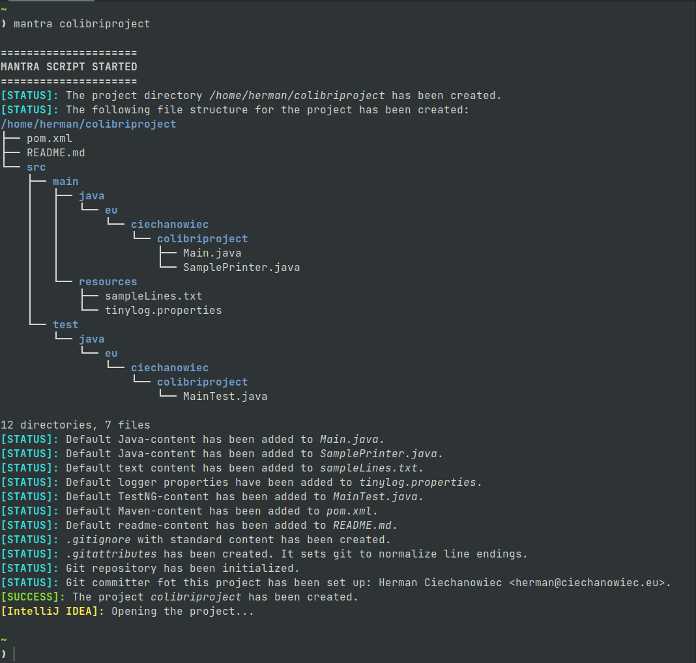

# Mantra

## Table of Contents
1. [Basic Info](#Basic-Info)
2. [Script's Algorithm](#Scripts-Algorithm)
3. [Screenshots](#Screenshots)
4. [License](#License)

## Basic Info
This program is a Shell script for Linux Ubuntu. Its purpose is to create a template Java project with Maven, JUnit and Git functionality out of the box.
| Parameter                               | Data                                             |
| :-------------------------------------: | :----------------------------------------------: |
| Program name:                           | Mantra                                           |
| Date of creation:                       | March 2022                                       |
| Technologies used:                      | Shell                                            |
| Time spent to <br/> create the program: | ~1 day                                           |
| Author:                                 | Herman Ciechanowiec <br/> herman@ciechanowiec.eu |
| License:                                | MIT No Attribution License                       |

## Script's Algorithm
The script is executed according to the following algorithm:

1\. Show welcome message<br/>
2\. Verify prerequisite conditions:<br/>
2.1. _tree_ package is installed<br/>
2.2. _git_ package is installed<br/>
2.3. strictly two arguments were provided:<br/>
2.3.1. an absolute path where the project directory is to be created<br/>
2.3.2. a project name<br/>
2.4. the provided absolute path where the project directory is to be created is correct<br/>
2.5. the provided project name is correct (should consist only of lower case alphanumericals and the first character should be a letter)<br/>
2.6. the project directory hasn’t existed yet<br/>
3\. Create the project directory (name of the project directory is the project name)<br/>
4\. In the project directory create the following file structure:<br/>
```
/home/herman/colibriproject [this line may differ]
├── pom.xml
├── README.md
└── src
    ├── main
    │   ├── java
    │   │   └── com
    │   │       └── Main.java
    │   └── resources
    └── test
        └── java
            └── com
                └── MainTest.java
```     
The above file structure implements the default file structure used by maven-archetype-quickstart and described at https://maven.apache.org/guides/getting-started/maven-in-five-minutes.html (captured on March 2022)<br/>
5\. Add default Java-content to _Main.java_ (`main` method which prints “Hello, Universe!”)<br/>
6\. Add default JUnit-content to _MainTest.java_ (_JUnit_ `assertTrue` test which always passes)<br/>
7\. Add default Maven-content to _pom.xml_ which i.a.:<br/>
7.1. provides basic information about the project (`groupId`, `artifactId`, `version`, `packaging`, `name`, `description`, `url`)<br/>
7.2. creates _MANIFEST.MF_ which points to the main method<br/>
7.3. adds _JUnit_ and related testing dependencies<br/>
7.4. prevents from building if any of tests hasn’t passed<br/>
8\. Add default content do _README.md_ (the project name and date of creation)<br/>
9\. Add _.gitignore_ file which sets git to ignore:<br/>
9.1. all files with _.class_ extension<br/>
9.2. all files with _.log_ extension<br/>
9.3. all files and directories named _logs_<br/>
9.4. _target_ directory located directly in the project directory<br/>
9.5. all files and directories which names start with _. (dot)_, except _.git_, _.gitattributes_ and _.gitignore_<br/>
10. Add _.gitattributes_ file which normalizes line endings<br/>
11\. Initialize git repository in the project directory<br/>
12\. Show finish message on successful project creation<br/>
13\. Propose to open the project directory in the new window with VS Code if installed<br/>

## Screenshots
<kbd></kbd><br/>

## License
The program is subject to MIT No Attribution License

Copyright © 2022 Herman Ciechanowiec

Permission is hereby granted, free of charge, to any person obtaining a copy of this
software and associated documentation files (the "Software"), to deal in the Software
without restriction, including without limitation the rights to use, copy, modify,
merge, publish, distribute, sublicense, and/or sell copies of the Software, and to
permit persons to whom the Software is furnished to do so.

The Software is provided "as is", without warranty of any kind, express or implied,
including but not limited to the warranties of merchantability, fitness for a
particular purpose and noninfringement. In no event shall the authors or copyright
holders be liable for any claim, damages or other liability, whether in an action
of contract, tort or otherwise, arising from, out of or in connection with the
Software or the use or other dealings in the Software.
